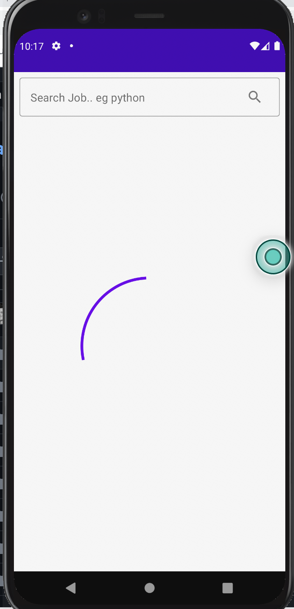
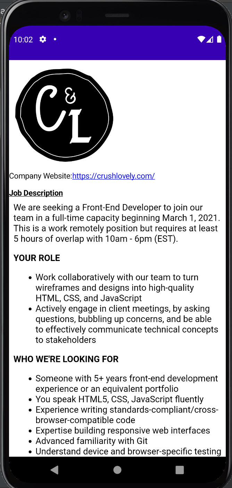

## GitHub Job Search UI using Jetpack Compose
I have been on an adventure learning core parts of Jetpack Compose and in this project, I explore core concepts. The project uses the following
- [Retrofit](https://square.github.io/retrofit/) for networking
- [Hilt](https://developer.android.com/training/dependency-injection/hilt-android) for dependency injection on Android
- [Accompanist](https://github.com/google/accompanist) for loading images from the network

The project uses the navigation component where each destination is a fragment and each fragment is inflated using Jetpack compose and navigation is handled using Jetpack navigation component

One noticeable thing to is that I used interoperability with a traditional Android View which is the webView for loading the job description text

### Architecture used
I have tried as much as possible to follow the MVVM pattern as recommended by the Android team.

Here are the screens

